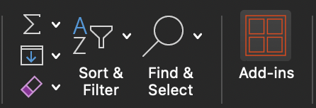
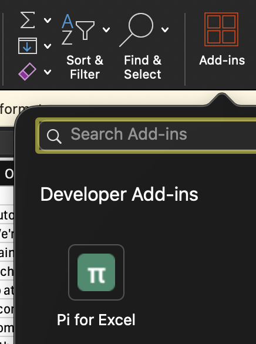

# Install Pi for Excel

No coding or dev tools required — just download one file and add it to Excel.

---

## 1) Download the manifest file

Download this file and save it somewhere you can find it (e.g. your Desktop):

👉 **[manifest.prod.xml](https://pi-for-excel.vercel.app/manifest.prod.xml)**

<details>
<summary>Alternate download links (if the above is unavailable)</summary>

- Latest release: https://github.com/tmustier/pi-for-excel/releases/latest
- Direct repo copy: https://github.com/tmustier/pi-for-excel/blob/main/manifest.prod.xml

</details>

---

## 2) Add it to Excel

### macOS

1. Open Finder and press **Cmd + Shift + G** (Go to Folder)
2. Paste this path and press Enter:
   ```
   ~/Library/Containers/com.microsoft.Excel/Data/Documents/wef
   ```
3. Copy `manifest.prod.xml` into that folder
4. Quit Excel completely (Cmd + Q) and reopen it
5. Go to **Insert → My Add-ins** — you should see **Pi for Excel** listed. Click it to register the add-in.
6. Now look for the **Add-ins** button on the far right of the **Home** ribbon tab (it looks like four orange squares). Click it, then click **Pi for Excel** to open the sidebar.

   
   

> **Folder doesn't exist?** Create it first — open Terminal and run:
> ```bash
> mkdir -p ~/Library/Containers/com.microsoft.Excel/Data/Documents/wef
> ```
> Then repeat from step 3.

For more detail, see [Microsoft's guide for Mac](https://learn.microsoft.com/en-us/office/dev/add-ins/testing/sideload-an-office-add-in-on-mac).

### Windows

You can try to install and run this on Windows — it might work!

1. Open Excel
2. Go to **Insert → My Add-ins**
3. Click **Upload My Add-in…**
4. Select the `manifest.prod.xml` file you downloaded
5. Click **Open Pi** in the ribbon

For more detail, see [Microsoft's guide for Windows](https://learn.microsoft.com/en-us/office/dev/add-ins/testing/sideload-office-add-ins-for-testing).

---

## 3) First-run check

1. Open the taskpane (click the **Add-ins** button in the Home ribbon tab, then click **Pi for Excel**)
2. Connect a provider (see below)
3. Send a test prompt, e.g.:
   - `What sheet am I currently on?`
   - `Summarize my current selection`

If you get a response, install is complete.

---

## 4) Connect a provider

### Recommended (easiest): API key

For most users, API keys are the smoothest setup and usually do **not** need the proxy.

1. In Pi, run `/login` (or use the welcome screen)
2. Expand a provider row (OpenAI, Google Gemini, Anthropic, etc.)
3. Paste your API key
4. Click **Save**

### OAuth / account login (Anthropic, OpenAI ChatGPT, Google Code Assist/Antigravity, GitHub Copilot)

1. In `/login`, click **Login with …**
2. Complete login in the browser window that opens
3. Return to Excel and complete any prompt shown
   - For OpenAI + Google OAuth flows, copy the final browser URL (it may be a `localhost` callback URL) and paste it when prompted
   - Some Google workspace tiers may also ask for a Google Cloud project ID during setup

If login fails with a CORS/network error, follow the next section.

---

## OAuth logins and CORS proxy

Some OAuth/token endpoints are blocked by CORS inside Office webviews (especially on macOS WKWebView).

Typical symptoms:
- `Login was blocked by browser CORS`
- `Load failed`
- `Failed to fetch`

### What to do

1. Run a local HTTPS proxy on the same machine as Excel (defaults to `https://localhost:3003`):

> ⚠️ **You may be asked for your Mac password** during this step. The proxy creates a local security certificate so Excel can talk to it securely. This is a one-time setup. If you are not an admin on this machine, ask your IT team to run this step for you.

If you already have Node.js:

```bash
npx pi-for-excel-proxy
```

If you do not have Node.js (or are unsure):

```bash
curl -fsSL https://piforexcel.com/proxy | sh
```

2. In Pi, open `/settings` → **Proxy**:
   - enable **Proxy**
   - set URL to `https://localhost:3003`

3. Retry OAuth login

Quick proxy sanity check (advanced):
- In Terminal, run:

```bash
curl -k -i -s \
  'https://localhost:3000/api-proxy/google-cloudcode/v1internal:streamGenerateContent?alt=sse' \
  -X POST -H 'content-type: application/json' -d '{}' | head
```

- `401` means proxy routing is working (request reached Google, but without auth token).
- `404` usually means a proxy/path issue.
- Use single quotes around the URL in zsh so `?alt=sse` is not treated as a glob.

Notes:
- Keep the proxy URL on **HTTPS** (`https://...`), not HTTP.
- API-key providers generally work without proxy.
- If port `3003` is busy, run with another port and use that same URL in settings:

```bash
PORT=3005 npx pi-for-excel-proxy
```

---

## Updates

If you installed with `manifest.prod.xml`, Pi for Excel loads from a hosted URL and most updates are automatic.

- Normal case: close/reopen Excel taskpane to pick up latest version.
- Rare case (manifest changes): download the new `manifest.prod.xml` and upload it again in Excel.

---

## Troubleshooting

### Pi does not appear in My Add-ins
- Re-open Excel and try again
- Ensure you uploaded `manifest.prod.xml` (not the localhost dev manifest)

### Taskpane opens but is blank
- Your network may block `https://pi-for-excel.vercel.app`
- Try a different network / VPN setting

### I installed, but changes are not visible
- Close and reopen Excel to clear cached taskpane state

### OAuth login still fails
- Confirm proxy is running and reachable at the exact URL in `/settings`
- Confirm proxy URL is `https://localhost:<port>` (not `http://`)
- Try API key auth as a fallback

---

## Developer setup (separate)

If you want to run from source (`localhost`, Vite, mkcert), use the root README: [Developer Quick Start](../README.md#developer-quick-start).
